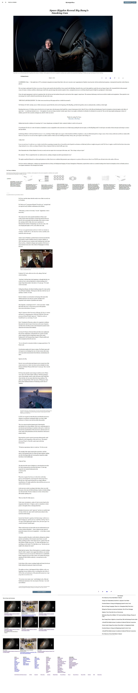

# PROJECT: POSITIONING AND FLOATING ELEMENTS (Microverse Collaborative Project)

> This project consists on using of plain HTML and CSS to create an article website.
> A reproduction of "the new york times" was used to complete the project (https://www.nytimes.com/2014/03/18/science/space/detection-of-waves-in-space-buttresses-landmark-theory-of-big-bang.html?_r=0)

#### Techniques used for positioning elements : 

float
flex
grid

## Built With

- HTML
- CSS

## Live Demo
- [Live Demo Link](https://raw.githack.com/karthykarthick/New-York-Times/tree/development)

#### Prerequisites
- Browser
- Internet
## Authors

👤 ** karthick harimoorthy **

- Github (https://github.com/karthykarthick)
- Linkedin (https://www.linkedin.com/in/karthick-harimoorthy/)

👤 **Ahmed Ben Jmii**

* Ahmed (https://github.com/Ahmed-Benj)
* Linkedin (https://www.linkedin.com/in/ahmed-b-05600992/)

## 🤝 Contributing

Contributions, issues and feature requests are welcome!

Feel free to check them https://github.com/karthykarthick/New-York-Times/issues.

## Show your support

Give a ⭐️ if you like this project!
